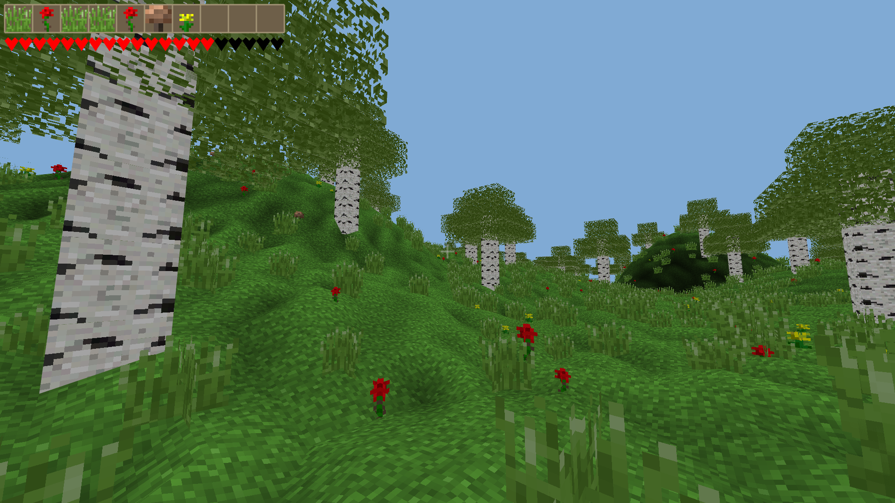

# glfield

### Общее описание
*GLField* - это тестовая сцена, которая сделана для практики *C++* и *OpenGl*. В ней можно ходить и кушать грибы, чтобы не умереть с голоду.  
Я использовал библиотеку `sfml3` (она несовместима с `sfml2.6`), которая, в свою очередь, использует библиотеку `stb_image`.

### Источники
Сделано на основе видео-уроков с youtube канала `Begin End`. Чем больше уроков я проходил, тем больше наша кодовая база стала расходиться. Под конец я стал реализовывать почти всё самостоятельно.  
*Ссылки на видео*:  
[OpenGL - Урок 19 - Создаем локацию. Добавляем освещение, текстуры и объекты.](https://www.youtube.com/watch?v=2CVDOGXUsvQ&pp=ygUSMTkg0YPRgNC-0Logb3Blbmds)  
[OpenGL - Урок 20 - Создаем деревья как в MineCraft.](https://www.youtube.com/watch?v=wquSuybNWBw)  
[OpenGL - Урок 21 - Как уйти в закат (Добавляем солнце и смену дня и ночи)](http://www.youtube.com/watch?v=6lnibnDBWSM)  
[OpenGL - Урок 25 - Симулятор пылесоса! Механика сбора ресурсов. Анимация сбора.](https://www.youtube.com/watch?v=nIdb1hhu1lg)  
[OpenGL - Урок 26 - Пишем игру симулятор грибника. Добавляем интерфейс, и едим грибочки.](https://www.youtube.com/watch?v=wuMT4uk51-Y)  
[OpenGL - Урок 27 - Бафаемся. Добавляем эффекты и отображаем время действия. (ДЗ урока 26)](https://youtu.be/BzFEvUYCe-Y)  
[OpenGL - Урок 28 - Делаем режим перетаскивания предметов Drag-and-Drop.](https://youtu.be/3w4IdSU9uhE)  

### Зависимости для работы
* sfml >= 3.0
* файл `game.conf` должен лежать рядом с программой. В этом файле указан путь до папки с ресурсами. Этот путь можно менять, если что-то не работает.

### Зависимости для сборки
Можете посмотреть как установить их в папке `os-deps`:  
1. компилятор под вашу платформу (`gcc`/`clang`, `mingw`)
2. ninja
3. cmake
4. vcpkg
5. sfml >= 3.0 (установится сама через vcpkg)
6. python (не обязательно, если знаете, как запустить cmake вручную)

### Управление
* ESC - выйти из игры  
* WASD - ходьба   
* SPACE - прыжок  
* SHIFT - бежать  
* U - перематывать время  
* K - респавн  
* E - взаимодействовать с инвентарём  
* LMB - собирать, использовать предметы  
* RMB - перетаскивать предметы в сумке и меню крафта  

### Готовая программа 
Для тех, кто не хочет заморачиваться с компиляцией: готовые исполняемые файлы лежат в папке `bin`. Если использовать уже готовые бинарники, то скорее всего они будут старой версии.

### Компиляция
На данный момент я не знаю как скомпилировать программу, находясь в ОС `Windows`.  

Инструкции по компиляции лежат в папке `docs`. Вообще исходный код программы состоит из более общей части (`CommmonCode`), которую я буду использовать в других проектах, и конкретной реализации сцены в `src`.

